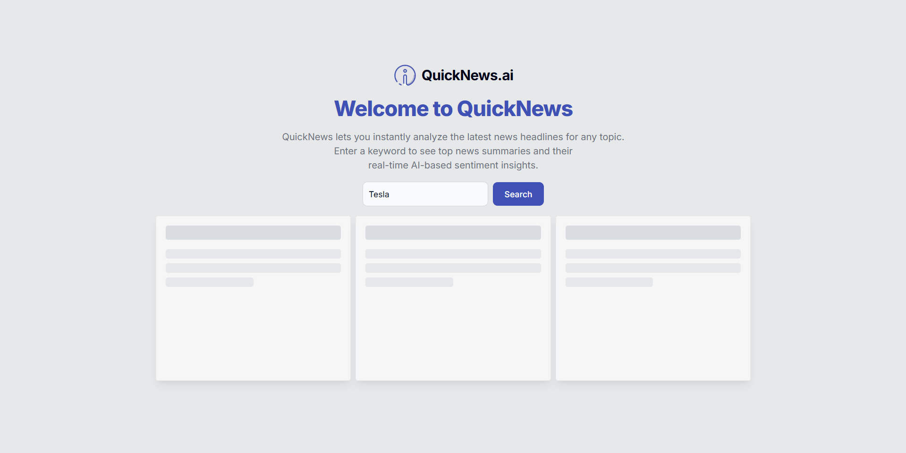
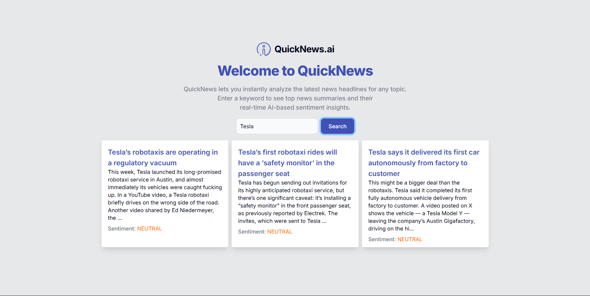

#  QuickNews.ai

QuickNews.ai is a lightning-fast news summarization and sentiment analysis web app that helps you stay informed without information overload.

## 🚀 Overview

QuickNews.ai fetches the latest news articles from multiple sources, analyzes their sentiment, and presents concise summaries with clear sentiment tags – positive, neutral, or negative – so you can quickly gauge the tone of current events.

### ✨ Features

- 🔎 **Keyword-Based Search**: Find articles on any topic or keyword.
- 📝 **Summarization**: View short, clear summaries for each article.
- 😊 **Sentiment Analysis**: Instantly see the general sentiment of news pieces.
- ⚡ **Fast & Minimalist UI**: Clean interface for an efficient reading experience.

### 🛠️ Tech Stack

- **Frontend**: Next.js, Tailwind CSS
- **Backend**: Node.js, TypeScript, Serverless Framework
- **APIs & Services**:
  - News API for fetching real-time news
  - Machine Learning model for sentiment analysis
- **Hosting**: AWS Lambda (Serverless deployment)

### 💡 Vision

Not every CS major has to be “cracked.” Build and ship fast. Do what you enjoy. Make projects that are useful and fun.

QuickNews.ai was built in under **6 hours** to combine rapid technical learning with practical problem-solving.

## 📷 Preview

<table>
  <tr>
    <td rowspan="2">
      
    </td>
    <td>
      
    </td>
  </tr>
  <tr>
    <td>
      
    </td>
  </tr>
</table>

---

> Built with ❤️ by [Arboy Magomba](https://github.com/arboydev27).

